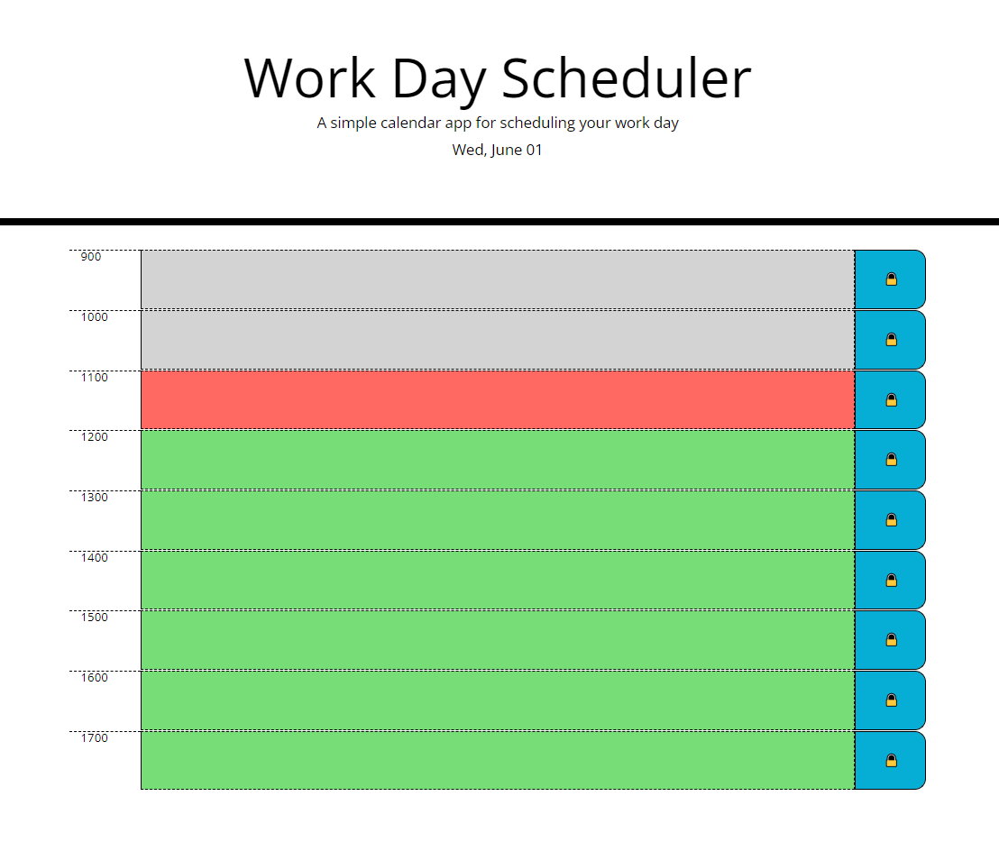

# Work Day Schedulyer

## Description
The Work Day Scheduler is a program to organize and assist you with strucuring your day from 900 to 1700. You can write your to-do list into the text input and save it to your local storage using the lock button to the right of the input. As the day progresses the input background color changes to reflect wether your to-do item is in the past, present, or future.

## Table of Contents
- [Installation](#installation)
- [Contribution](#contribution)
- [License](#license)
- [Contact](#contact)

## Installation
No installatino required. Just head on over to the deployed link at https://jixxin.github.io/work_day_scheduler/

## Contribution
Code written by Jeff Hicks

## License
This project is licensed with MIT License. 

## Contact
- Author: Jeff Hicks
- Email: hicks.jeff@me.com
- Github: https://github.com/jixxin